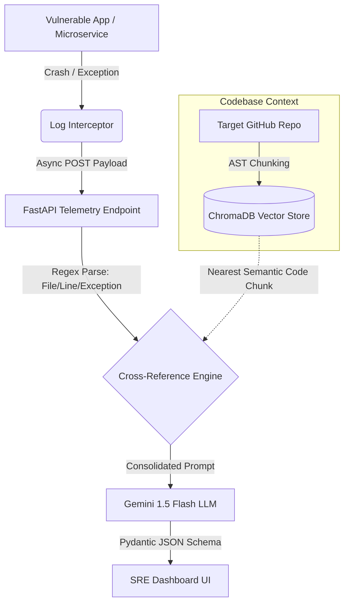

<div align="center">

# 🛡️ Sentinel AI

**Autonomous Site Reliability Engineering (SRE) Agent**

[](https://www.python.org/downloads/)
[](https://fastapi.tiangolo.com)
[](https://trychroma.com)
[](https://deepmind.google/technologies/gemini/)
[](https://www.docker.com/)

*An end-to-end, AI-driven observability pipeline that intercepts raw crash logs, cross-references them against codebase semantic vectors, and autonomously generates production-ready root cause analyses and patches in real-time.*

### 🚀 **[Live Demo: Sentinel AI Command Center](https://huggingface.co/spaces/anshullakra8/sentinel-ai)**

</div>

---

## ⚡ The Problem

When a production outage occurs, DevOps engineers and SREs spend critical minutes (often hours) tracking down stack traces, finding the exact file and function responsible in a massive codebase, and writing a patch. This drives up **Mean Time to Recovery (MTTR)** and costs businesses thousands of dollars per minute.

## 🚀 The Solution: Sentinel AI

Sentinel AI eliminates the manual debugging bottleneck. It streams asynchronous telemetry, uses an Abstract Syntax Tree (AST) aware chunking system to embed your codebase into a local Vector Database, and utilizes Google's Gemini LLM to diagnose crashes instantly. 

### Key Features
* **Zero-Latency Context Ingestion:** Parses source code using LangChain's Python-specific splitters to preserve function boundaries, then embeds them into ChromaDB using `all-MiniLM-L6-v2`.
* **Asynchronous Telemetry Receiver:** A highly concurrent FastAPI backend designed to process crash logs without bottlenecking the main application.
* **Semantic Cross-Referencing:** Extracts file metadata and exception context via Regex, then performs hybrid vector searches to retrieve the exact broken code snippet.
* **Deterministic AI Diagnostics:** Forces the Gemini LLM into a structured Pydantic schema to return exact impact levels, root causes, and diff patches.
* **Interactive SRE Command Center:** An enterprise-grade, dark-mode terminal UI built with Tailwind CSS. Features real-time metric updates and status pills.
* **GitHub-Style Code Diff Visualizer:** Vanilla JS DOM manipulation that provides clean, color-coded visual patches.
* **Live Chaos Engineering Trigger:** A 1-click crash simulation button right on the dashboard to test the observability pipeline instantly.

---

## 🏗️ Architecture Flow



---

## 🏎️ Performance Benchmarks

The system was aggressively load-tested using a custom asynchronous benchmarking suite to measure end-to-end telemetry resolution speeds under heavy concurrency, evaluating the VectorDB caching, Deduplication engine, and LLM latency.

**[View the Deep Exhaustive Benchmarking Report](BENCHMARKS.md)** for detailed metrics on:
- Complex Errors (LLM Required) at varying concurrency loads
- Deduplication Engine performance (100 concurrent identical requests)
- LLM Bypass Fallbacks for Syntax Errors

*Sentinel AI catches, cross-references, and patches production bugs in less than a quarter of a second for cached errors, and under a second for complex errors.*

---

## 🛠️ Quickstart Guide

### 1. Environment Setup
Clone the repository and install the required dependencies (requires Python 3.10+):
```bash
git clone https://github.com/anshullakra007/sentinel-ai.git
cd sentinel-ai
python3 -m venv venv
source venv/bin/activate
pip install -r requirements.txt
```

Create a `.env` file in the root directory and add your Google Gemini API key:
```env
GEMINI_API_KEY="your_api_key_here"
```

### 2. Ingest the Codebase
Embed the sandbox codebase into the local vector database:
```bash
python ingest.py --path sandbox
```

### 3. Launch the SRE Command Center
Start the Sentinel AI telemetry server natively:
```bash
python server.py
```
Visit `http://localhost:8000` to open the Dashboard.

### 4. Docker & Cloud Deployment
Sentinel AI is fully containerized and production-ready for deployment to Hugging Face Spaces or AWS/Render. The `Dockerfile` natively configures a strict non-root user (UID 1000) and exposes port `7860` for compliance with enterprise PaaS environments.

To spin up the entire multi-container architecture locally:
```bash
docker-compose up --build
```
This single command spins up both the **Sentinel Core Telemetry Server** (port 8000) and the **Vulnerable Sandbox App** (port 8001), automatically networking them together.

---

<div align="center">
<i>Built to eliminate MTTR. Engineered for resilience.</i>
</div>
